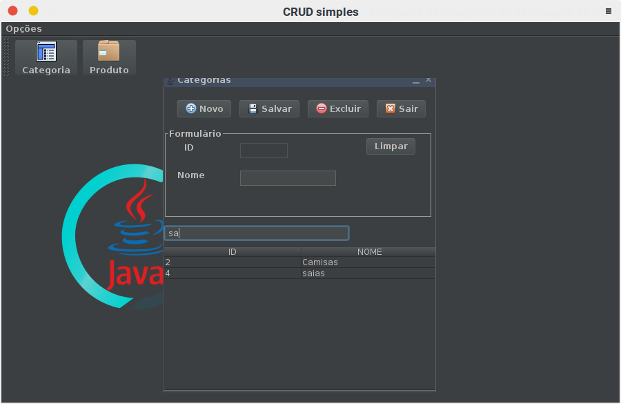
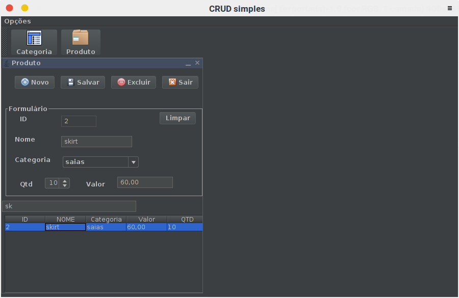
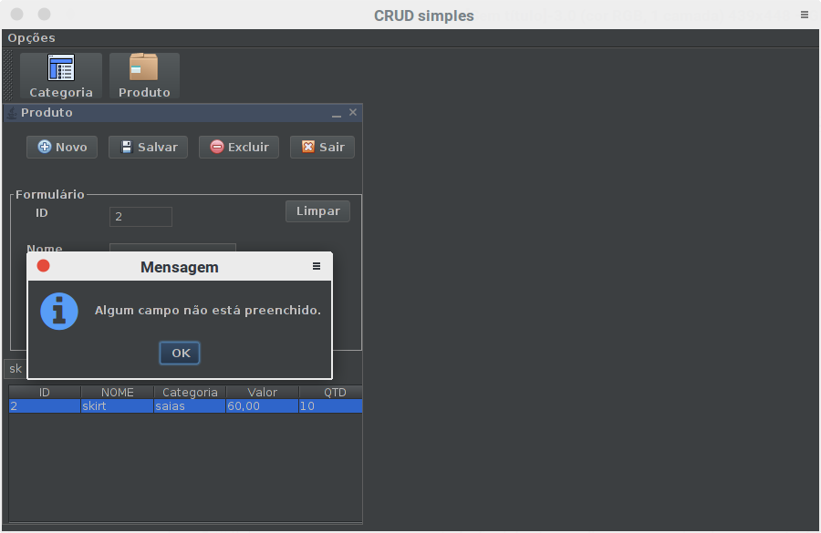

# Sistema CRUD feito em Java

## Objetivo

<p> A história desse projeto é bem engraçada, meu objetivo era iniciar os estudos com JPA.
Porém, para assegurar que estava dominando, diz "manjando" do assunto :), resolvir seguir
um <a href="https://www.youtube.com/playlist?list=PLWd_VnthxxLevWyNp4Qsvhog2iFbwmPwy" target="_blank">tutorial</a> no YouTube onde era apresentado a conexão com banco aravés do JDBC e que utilizava
<i>'querys'<i> para trabalhar com os dados do banco. Logo, fiquei empolgado e quiz dar uma cara mais
        amigavel para o sistema criando, assim, uma interface gráfica.</p>

## Como foi feito

<p>Na elaboração do projeto utilizei a IDE netbeans, apenas por escolha pessoal, e para criação 
    da interface gráfica utilizei a biblioteca swing do Java.
    Algo novo que utilizei foi um framework para testes, o <a href="https://junit.org/junit5/" target="_blank">JUnit</a>, que possibilita testar as classes com objetivo
de assegurar o seu bom funcionamento no sistema.
</p>

<p>Esse projeto descreve um simples <strong>CRUD</strong> de duas tabelas. O sistema foi inspirado
    nas video aulas do canal <a href="https://www.youtube.com/channel/UCgOu28f2-cdegVHuZZhLDdA" target="_blank">descompila</a> do YouTube. O que fiz de diferente foi criar um sistema de interface gráfica.
</p>

### O que utilizei

<p>
    Segui aqui o que utilizei para construir o projeto:
    <ul>
        <li> IDE NetBeans;</li>
        <li> JUnit (Como já mensionado);</li>
        <li> Java =);</li>
        <li> mysql connector;</li>
        <li> <a href="https://github.com/bulenkov/Darcula" target="_blank">darcula</a> (para dar um tema escuro no programa);</li>
        <li> Paciênia...</li>
    </ul>
</p>

## Como executar

<p>O  jeito mais simples é abrir o projeto no netbeans. Outro jeito de executar é atravé do prompt de comando com a instrução abaixo:</p>

``` bash
$ java -cp dist/JavaJDBC.jar:dist/lib/*.jar Main 
```
<p>
    Também é necessário criar o banco <i>descompila</i>, o script mysql do banco 
está no arquivo <i>"descompila.sql"</i>.
</p>

## Imagens


<br>


<br>


## Comentários

<p>
    Para deixar o tema escuro tive de instalar o <i>jar</i> darcula.
</p>
<p>
    E com o seguinte método deixei o tema todo escuro:
</p>
``` java
 private static void lookTest(){
        try {
            javax.swing.UIManager.setLookAndFeel(new com.bulenkov.darcula.DarculaLaf());
        } catch (UnsupportedLookAndFeelException ex) {
            System.out.println(ex.getMessage());
        }
        catch(ExceptionInInitializerError ex){
            System.out.println("Erro inicializar => "+ex.getMessage());
            
        }
    }
```
<p>
    Se alguém encontrar um erro ou tiver uma dica crie um PR ou me envie um e-mail:
<a href="mail:johnwill.v.2017@gmail.com">johnwill.v.2017@gmail.com</a>. Agradeceria e muito
pela atenção! "<i>Os primeiros passos são duros e sei que há muitos que podem me ajudar a caminhar!</i>"
_ &nbsp;John William Vicente. 
</p>